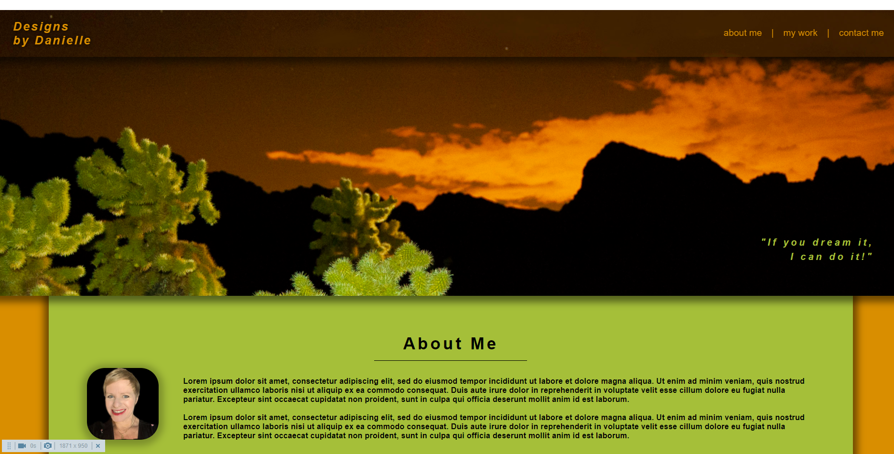

# My Portfolio

## Purpose
This website will serve to provide future links to my projects and offer contact information.

This site offers an alternative "mobile site" for those viewing on <768px screens.  Otherwise it is responsive and shrinks and grows as needed.

## Built With
* HTML5
* CSS, including FlexBox, Grid, CSS animations and pseudoclasses.

## Website
https://webprinc3ss.github.io/portfolio/

## Media
  
  

## Credit
Hand-coded and designed with ❤️ by webprinc3ss (me).

"Hero" photograph taken in the desert by me during a night photography class.

Kitten graphics courtesy of https://placekitten.com/.
